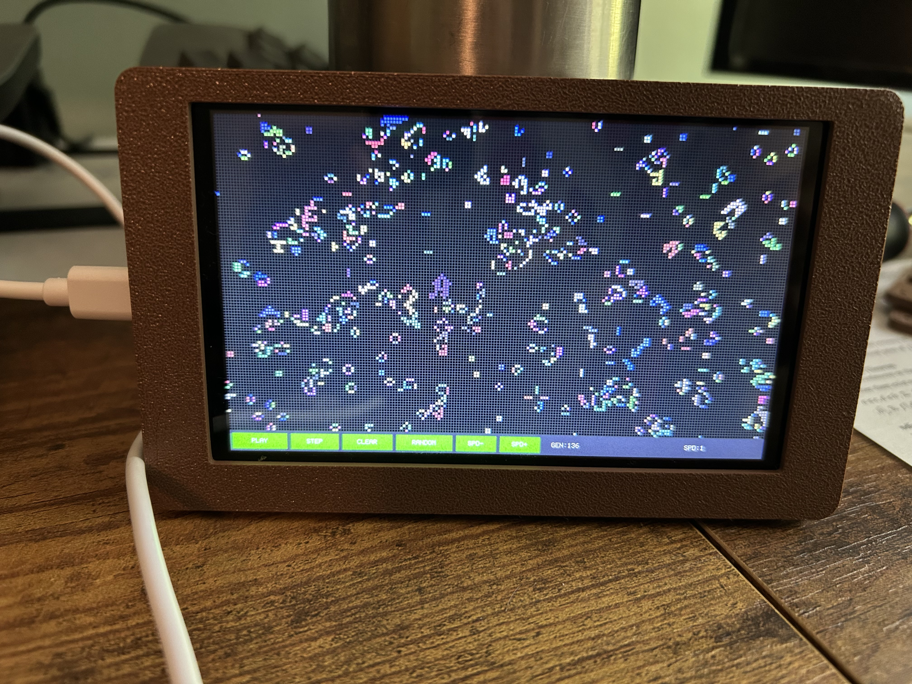
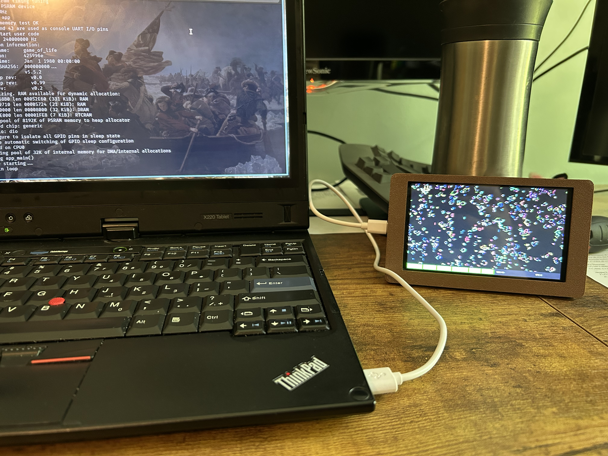

#+TITLE: Conway's Game of Life in Nim for the ESP32-S3
#+AUTHOR: Brad White
#+DATE: 2026-04-09

* Game of Life — ESP32-S3 (Nim)

Conway's Game of Life running on an _ESP32-S3_ with an _Elecrow 5" 800×480 RGB panel_ and _GT911 capacitive touch controller_. Written in Nim, compiled to C via ESP-IDF.

** Photos

** Display
[[Elecrow ESP32 5-inch Display][https://www.amazon.com/ELECROW-Dual-Core-Compatible-PlatformIO-MicroPython/dp/B0DL5WB7RQ/ref=sr_1_3?sr=8-3]] (800×480 RGB565)

** Features

- 200×112 cell grid (4×4 pixel cells) with toroidal wrapping
- Connected-component labeling — each organism gets a unique color
- Touch drawing: tap to toggle cells, drag to paint
- UI bar with PLAY/PAUSE, STEP, CLEAR, RANDOM, SPD-/SPD+ buttons
- ~30 FPS rendering with frame-rate capped main loop
- Hardware RNG seeded LCG for randomization

** Prerequisites

- [[https://nim-lang.org/install.html][Nim]] >= 2.0
- [[https://docs.espressif.com/projects/esp-idf/en/latest/esp32s3/get-started/][ESP-IDF]] v5.2+
- [[https://nixos.org/download.html][Nix]] (optional, provides reproducible dev environment)

** Build (Nix)

#+begin_src bash
# Enter the dev shell (installs Nim, ESP-IDF, etc.)
nix develop

# Inside the nushell environment:
build    # Compile Nim to C + idf.py build
flash    # Flash and monitor via /dev/ttyUSB0
#+end_src

** Build (Manual)

#+begin_src bash
source $IDF_PATH/export.sh
idf.py set-target esp32s3
cd main && nim c main.nim && cd ..
idf.py build
idf.py -p /dev/ttyUSB0 flash monitor
#+end_src

** Hardware Wiring

| Signal | GPIO |
|--------+------|
| LCD DE | 40 |
| LCD VSYNC | 41 |
| LCD HSYNC | 39 |
| LCD PCLK | 0 |
| LCD Data[0..15] | 8,3,46,9,1,5,6,7,15,16,4,45,48,47,21,14 |
| Backlight | 2 |
| Touch SDA | 19 |
| Touch SCL | 20 |
| Touch INT | 38 |

** Project Structure

#+begin_example
├── flake.nix              # Nix dev shell (FHS env with Nim + ESP-IDF)
├── CMakeLists.txt         # Top-level ESP-IDF project
├── sdkconfig.defaults     # ESP-IDF Kconfig (PSRAM, LCD, etc.)
├── game_of_life.nimble    # Nim package file
└── main/
    ├── CMakeLists.txt     # IDF component (compiles nimcache/)
    ├── config.nims        # Nim compiler flags
    ├── main.nim           # Entry point, render loop, UI, touch routing
    ├── display.nim        # RGB LCD panel driver (esp_lcd C API)
    ├── simulation.nim     # GoL logic, connected-component labels, PRNG
    └── touch.nim          # GT911 I2C touch driver
#+end_example
